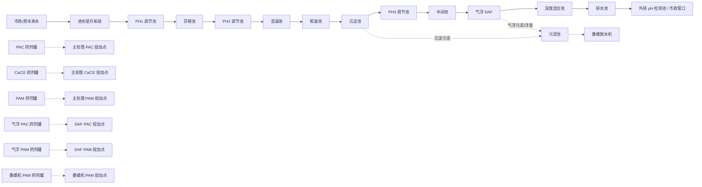
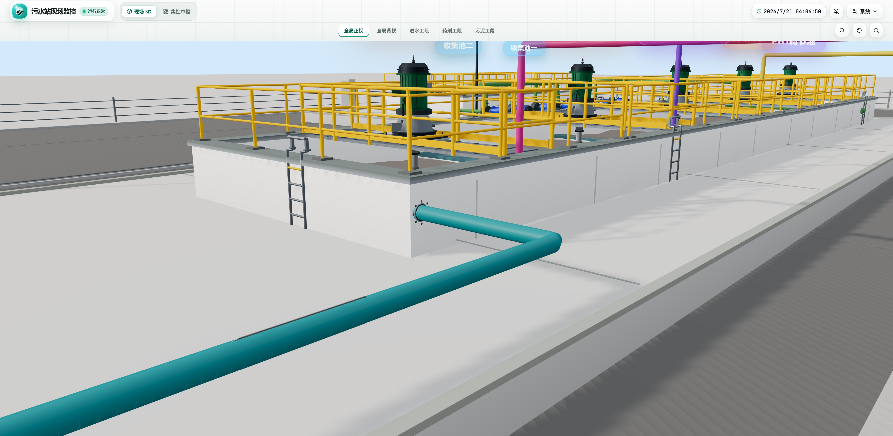

# 污水 SCADA 管路流程总表

本文档是当前 3D 场景管路连接的基准表。工艺水与污泥管网采用独立的、按流程图重建的实现：

```text
src/components/3d/sections/IndustrialPipeNetwork3D.tsx
src/components/3d/sections/ProcessAndSludgePipeNetwork3D.tsx
src/components/3d/sections/ChemicalPipeRouting.tsx
```

当前管网不依赖旧的 route/anchor token；已停用的旧管路体系已从源码中清理，避免与现行连接逻辑并存。

## 1. 总流程



## 2. 当前生效管路

### 2.1 主水线 / 工艺水线

| 管线 ID | 起点 | 终点 | 设计原则 |
|---|---|---|---|
| 进水提升总管 → PH1 | 进水提升泵总管 | PH1 调节池 | 原水主管，走外部清晰折线路径 |
| PH1 → 芬顿 → PH2 → 混凝 → 絮凝 | 池间溢流 / 跌水 | 无外部管路 | 由 `OverflowCascade3D` 表达，不画外部管 |
| 絮凝 → 沉淀 | 絮凝池 | 沉淀池 | 池北侧外部短跳管 |
| 沉淀 → PH3 | 沉淀池 | PH3 调节池 | 池北侧外部短跳管 |
| PH3 → 中间 | PH3 调节池 | 中间池 | 池北侧外部短跳管 |
| 中间池 → 中间提升泵 → DAF | 中间池 / 中间提升泵组 | DAF 气浮池 | 泵前双吸入支路、出水总管和厂区西侧独立走廊 |
| DAF → 深度混合 | DAF 气浮池 | 深度混合池 | 池北侧外部短跳管 |
| 深度混合 → 排水 | 深度混合池 | 排水池 | 池北侧外部短跳管 |
| 排水池 → 排水泵 → 外排 | 排水池 / 排水泵组 | 外排检测池 | 泵前双吸入支路、出水总管和下落管口 |

### 2.2 药剂投加线

| 管线 ID | 起点 | 终点 | 设计原则 |
|---|---|---|---|
| `fresh-pac-to-main-dosing` | PAC 药剂罐 | 主处理 PAC 投加点 | 罐出口接两台计量泵吸入口，泵出口汇流后进入高位管廊 |
| `fresh-cacl2-to-main-dosing` | CaCl2 药剂罐 | 主处理 CaCl2 投加点 | 一用一备计量泵撬装后接高位药剂管廊 |
| `fresh-pam-to-main-dosing` | PAM 药剂罐 | 主处理 PAM 投加点 | 一用一备计量泵撬装后接高位药剂管廊 |
| `fresh-daf-pac-to-daf-dosing` | 气浮 PAC 药剂罐 | DAF PAC 投加点 | 一用一备计量泵撬装后接 DAF 投加点 |
| `fresh-daf-pam-to-daf-dosing` | 气浮 PAM 药剂罐 | DAF PAM 投加点 | 一用一备计量泵撬装后接 DAF 投加点 |
| `fresh-screw-pam-to-press` | 叠螺机 PAM 药剂罐 | 叠螺机 PAM 投加点 | 一用一备计量泵撬装，汇流后沿高位主管下接叠螺机 |

### 2.3 污泥线

| 管线 ID | 起点 | 终点 | 设计原则 |
|---|---|---|---|
| 沉淀排泥 → 污泥池 | 沉淀池排泥泵组 | 污泥池 | 双泵吸入/出水总管后接入统一接收总管 |
| DAF 浮渣 → 污泥池 | DAF 浮渣泵组 | 污泥池 | 双泵吸入/出水总管，沿深处理外缘接入统一接收总管 |
| 污泥池 → 叠螺机 | 污泥池排泥泵组 | 叠螺脱水机进泥口 | 双泵吸入/出水总管，支管下接叠螺机法兰口 |

## 3. 本轮视觉精修

- 药剂罐底部 4 个黑色小支脚已移除，改为浅色一体式 PE 底座，避免看起来像黑点/脏点。
- 高位药剂管廊已增加门型支架与横梁，减少悬空线条感。
- 长距离外部工艺管继续使用管托支撑，保持工业现场的支撑逻辑。
- 水泵接口统一使用短锥形变径连接，管线不再以不同直径直接穿入泵体。
- 三通分支延伸到主管中心线，以同材质实体重叠形成圆滑连接，不再附加凸出的焊环。
- 池壁穿孔统一沿墙面法线进出，并避开池体角点。
- 双泵总管按两端向汇流点的方向分别渲染流向，封头前不再出现反向箭头或多余管段。

絮凝池出水口壁面接口的现场确认截图：



## 4. 场景挂载位置

主场景挂载进水、工艺水/污泥和药剂三套实体管网：

```tsx
<IndustrialPipeNetwork3D />
<ProcessAndSludgePipeNetwork3D />
<ChemicalPipeRouting />
```

挂载文件：

```text
src/components/3d/SCADAScene.tsx
```

旧的分散式工艺水和污泥路由及空挂载组件已清理，不再与现行管网并存。

## 5. 建模规则

- PH1 → 芬顿 → PH2 → 混凝 → 絮凝这一段为连续池间溢流，不画外部连接管。
- 主水线采用正交折线、统一高度、统一后侧/外侧走廊，不再沿用旧坐标 token。
- 药剂线走高位管廊，向下接投加点，避免地面七扭八歪。
- 污泥线用棕色管路表达，与主水线和药剂线明确区分。
- 六组药剂线均按完整计量泵 skid 建模：药剂罐 → 一用一备计量泵 → 汇流变径 → 投加点。
- 后续主水或污泥管线必须在 `ProcessAndSludgePipeNetwork3D.tsx` 内按工艺走廊统一设计；进水提升段仍维护在 `IndustrialPipeNetwork3D.tsx`。不得使用旧 route/anchor token 直接驱动。

## 6. 下一轮精修重点

- 给药剂管廊增加更真实的管夹、标牌和分支阀。
- 按现场 P&ID 精修各泵组、池壁和叠螺机的真实接口位置。
