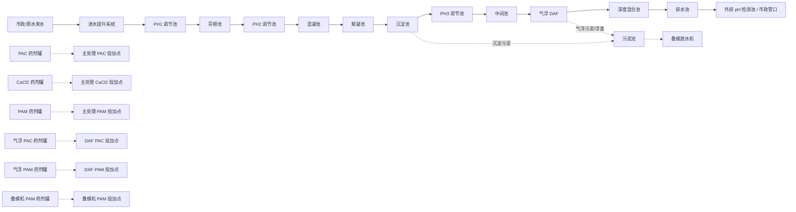

# 污水 SCADA 管路流程总表

本文档是当前 3D 场景管路连接的基准表。当前生效的管路系统已经切换为全新设计的：

```text
src/components/3d/sections/IndustrialPipeNetwork3D.tsx
```

该文件不再依赖旧的 `pipeRoutes.ts` / `anchors.ts` / 旧管路 token。旧文件保留仅作为历史参考，不再驱动画面里的管路。

## 1. 总流程



## 2. 当前生效管路

### 2.1 主水线 / 工艺水线

| 管线 ID | 起点 | 终点 | 设计原则 |
|---|---|---|---|
| `fresh-intake-header-to-ph1` | 进水提升泵总管 | PH1 调节池 | 原水主管，走外部清晰折线路径 |
| PH1 → 芬顿 → PH2 → 混凝 → 絮凝 | 池间溢流 / 跌水 | 无外部管路 | 由 `OverflowCascade3D` 表达，不画外部管 |
| `fresh-flocculation-to-clarifier` | 絮凝池 | 沉淀池 | 从絮凝池后段出水，走池后外部短跳管 |
| `fresh-clarifier-to-ph3` | 沉淀池 | PH3 调节池 | 短跳管，避免穿池 |
| `fresh-ph3-to-intermediate` | PH3 调节池 | 中间池 | 短跳管，避免穿池 |
| `fresh-intermediate-to-daf` | 中间池 / 中间提升段 | DAF 气浮池 | 深处理进水管，走独立外部走廊 |
| `fresh-daf-to-mixing` | DAF 气浮池 | 深度混合池 | 深处理短跳管 |
| `fresh-mixing-to-drainage` | 深度混合池 | 排水池 | 深处理短跳管 |
| `fresh-drainage-to-outfall` | 排水池 | 外排检测池 | 处理后水出水管 |

### 2.2 药剂投加线

| 管线 ID | 起点 | 终点 | 设计原则 |
|---|---|---|---|
| `fresh-pac-to-main-dosing` | PAC 药剂罐 | 主处理 PAC 投加点 | 高位药剂管廊，垂直下接投加点 |
| `fresh-cacl2-to-main-dosing` | CaCl2 药剂罐 | 主处理 CaCl2 投加点 | 高位药剂管廊 |
| `fresh-pam-to-main-dosing` | PAM 药剂罐 | 主处理 PAM 投加点 | 高位药剂管廊 |
| `fresh-daf-pac-to-daf-dosing` | 气浮 PAC 药剂罐 | DAF PAC 投加点 | 高位药剂管廊 |
| `fresh-daf-pam-to-daf-dosing` | 气浮 PAM 药剂罐 | DAF PAM 投加点 | 高位药剂管廊 |
| `fresh-screw-pam-to-press` | 叠螺机 PAM 药剂罐 | 叠螺机 PAM 投加点 | 最长 PAM 管线，走高位主管后下接叠螺机 |

### 2.3 污泥线

| 管线 ID | 起点 | 终点 | 设计原则 |
|---|---|---|---|
| `fresh-clarifier-sludge-to-sludge-tank` | 沉淀池排泥口 | 污泥池 | 棕色污泥线，走统一污泥走廊 |
| `fresh-daf-sludge-to-sludge-tank` | DAF 排泥 / 浮渣口 | 污泥池 | 棕色污泥线，避免随机斜穿 |
| `fresh-sludge-tank-to-screw-press` | 污泥池 | 叠螺脱水机 | 污泥脱水进泥管 |

## 3. 本轮视觉精修

- 药剂罐底部 4 个黑色小支脚已移除，改为浅色一体式 PE 底座，避免看起来像黑点/脏点。
- 高位药剂管廊已增加门型支架与横梁，减少悬空线条感。
- 长距离外部工艺管继续使用管托支撑，保持工业现场的支撑逻辑。

## 4. 场景挂载位置

主场景只挂载新的工业管路网络：

```tsx
<IndustrialPipeNetwork3D />
```

挂载文件：

```text
src/components/3d/SCADAScene.tsx
```

旧挂载已撤掉：

```tsx
<ProcessPipeRouting />
<ChemicalPipeRouting />
<SludgePipeRouting />
```

## 5. 建模规则

- PH1 → 芬顿 → PH2 → 混凝 → 絮凝这一段为连续池间溢流，不画外部连接管。
- 主水线采用正交折线、统一高度、统一后侧/外侧走廊，不再沿用旧坐标 token。
- 药剂线走高位管廊，向下接投加点，避免地面七扭八歪。
- 污泥线用棕色管路表达，与主水线和药剂线明确区分。
- 后续如果要恢复计量泵，应做成完整计量泵 skid：药剂罐 → 计量泵撬装 → 投加点。
- 后续新增管线必须在 `IndustrialPipeNetwork3D.tsx` 内按工艺走廊统一设计，不再使用旧 route/anchor token 直接驱动。

## 6. 下一轮精修重点

- 给药剂管廊增加更真实的管夹、标牌和分支阀。
- 给污泥线补泵入口/出口法兰，避免管线只表现为概念连接。
- 按现场 P&ID 精修各池壁接口的真实位置。
